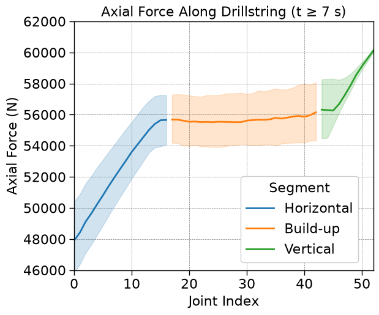
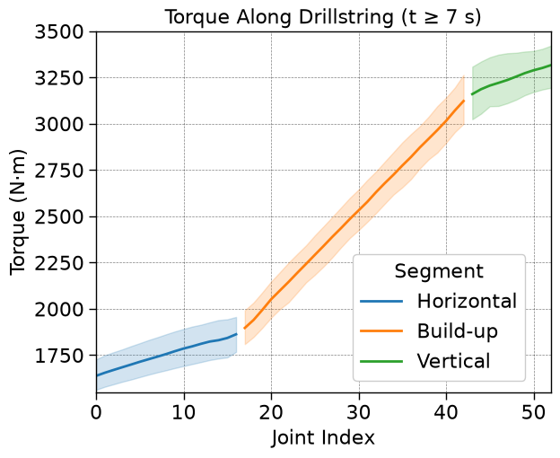
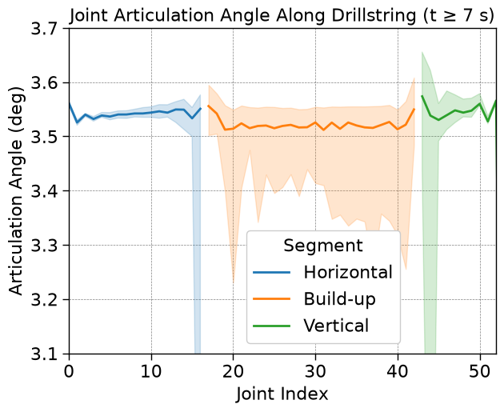
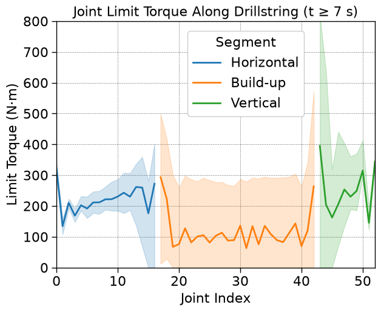
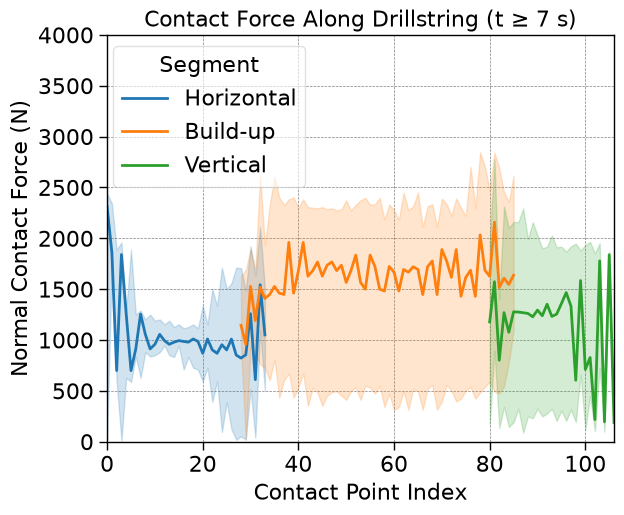

# Articulated Flexible Drillpipe Load & Contact Force Analysis

Post-processing and visualization of an Articulated Flexible Drillpipe (AFDP) dynamics simulation for ultra-short-radius horizontal wells, tracking axial force, torque, joint articulation, and contact loads as the pipe travels through the horizontal, build-up, and vertical sections of the well.

## Background

Ultra-short-radius horizontal well technology enables compact well trajectories where the build-up section has a very small curvature radius. It is particularly relevant to sidetracking from existing wells, low-cost production enhancement, and geothermal development. These applications place demanding mechanical requirements on an Articulated Flexible Drillpipe: the pipe must negotiate the transition from the vertical section through the build-up section and into the horizontal lateral while accommodating large joint articulation and sustained wellbore contact. The simulated well trajectory uses a build-up radius of 2.7 m. This project analyzes time-series output from a custom articulated rigid-body contact simulator (segmented flexible pipe + wellbore contact model, developed separately in C++) for a full-trajectory case (`ARC_FULL`: 55 segments, horizontal → build-up → vertical).

The simulator itself is a private/in-progress project; this repository contains the **Python analysis pipeline** and selected exported figures for one representative case. The raw simulation output is not included in the repository.

## Results

| Axial force | Torque |
|---|---|
|  |  |

| Joint articulation angle | Joint limit torque |
|---|---|
|  |  |

**Contact force**



Each line shows the median across simulation snapshots for `t ≥ 7 s` (steady-state, after initial transients settle), with shaded bands showing the 5th–95th percentile range; color indicates which section of the well trajectory (horizontal / build-up / vertical) a joint belongs to.

## Repository layout

```
analysis.ipynb        # main analysis notebook (data loading, segmentation, plots)
data/ARC_FULL/         # local simulation output (not tracked by Git)
figures/               # exported PNGs used in this README
src/fdp_arc/           # placeholder package (not currently used by the notebook)
```

## Simulation configuration

The figures shown below were generated from the `ARC_FULL` case. The table below records the parameters relevant to interpreting the analysis results; the original simulator configuration, wellbore input, and raw simulation output are not part of this repository.

| Parameter | Value |
|---|---:|
| Number of pipe segments | 55 |
| Segment outer radius | 0.053 m |
| Segment inner radius | 0.020 m |
| Segment length | 0.150 m |
| Segment density | 4890 kg/m³ |
| Time step | 0.0001 s |
| Maximum simulation time | 10 s |
| Target angular velocity | 6 rad/s |
| Top axial force | 60,000 N |

### Contact and joint model

| Parameter | Value |
|---|---:|
| Normal contact stiffness | 5 × 10⁷ N/m |
| Normal restitution coefficient | 1.5 |
| Static / dynamic friction coefficient | 0.4 / 0.3 |
| Static / dynamic transition velocity | 0.01 / 0.10 m/s |
| Articulation angle limit | 3.5° |
| Rotational limit stiffness | 300,000 N·m/rad |
| Rotational limit damping | 60 N·m·s/rad |

## Running it

This project uses [uv](https://docs.astral.sh/uv/) for dependency management. The raw simulation output is intentionally excluded from version control. To execute the notebook, place the required CSV files in `data/ARC_FULL/`:

```text
data/ARC_FULL/
├── pipe_load_profile.csv
├── joint_articulation.csv
└── contact_force.csv
```

These files must be generated by, or obtained from, the private simulator workflow before running the analysis.

```bash
uv sync
uv run jupyter lab analysis.ipynb
```

All paths in the notebook are relative to the repo root and expect the local `data/ARC_FULL/` dataset described above. The exported figures in `figures/` remain available without the raw data.

## Stack

Python, pandas, NumPy, seaborn/matplotlib (`scienceplots` style), Jupyter.
